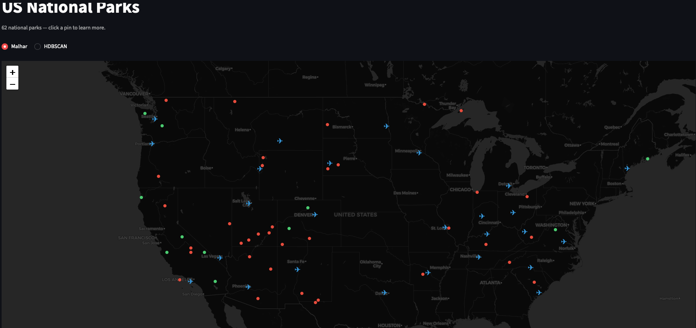

# National Park Planner

Interactive map of all US National Parks.



## Setup

**1. Create and activate a virtual environment**

```bash
python3 -m venv venv
source venv/bin/activate
```

**2. Install dependencies**

```bash
pip install -r requirements.txt
```

**3. Run the app**

```bash
cd src
streamlit run app.py
```

The app will open in your browser at `http://localhost:8501`.

## Adding or editing parks

Edit `src/config/parks.yaml` to add, remove, or update national park entries.
